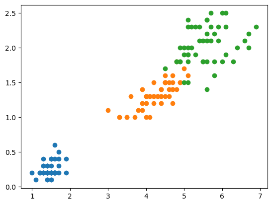
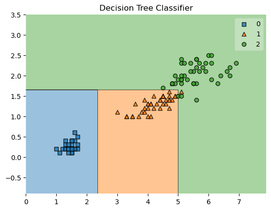

## LAB Assignment  
This lab introduces classical machine learning algorithms, decision trees (DTs) and their ensemble learning (e.g., Random Forests). Decision trees are important non-parameter learning methods. Although DTs are simple and limited, they still can achieve excellent performance using ensemble learning schemes.

For this lab assignment, we'll use the algorithms we've learned today to fit the model and evaluate the model’s prediction performance. The scikit-learn package will be used to save your time.


### Decision tree
- <font size=4>Step 1. load iris dataset </font>

Datasets: First, we load the scikit-learn iris toy dataset .


```python
import numpy as np
import matplotlib.pyplot as plt
from sklearn import datasets
iris = datasets.load_iris()
```

- <font size=4> Step 2. Define the features and the target </font>


```python
X = iris.data[:,2:]
y = iris.target
```

- <font size=4> Step 3. Visualization </font>
  
    We need to use proper visualization methods to have an intuitive understanding.

    For visualization, only the last 2 attributes are used.


```python
plt.scatter(X[y==0, 0], X[y==0, 1])
plt.scatter(X[y==1, 0], X[y==1, 1])
plt.scatter(X[y==2, 0], X[y==2, 1])
plt.show()
```


    

    


- <font size=4> Step 4. Preprocessing data </font>
Please check whether the data needs to be preprocessed


```python
########### Write Your Code Here ###########
from numpy import NaN

print(X.shape)
print(y.shape)
print(X.dtype)
Nan_flag = False
for i in X:
    if i[0] == NaN or i[1] == NaN:
        Nan_flag = True
for i in y:
    if y[0] == NaN:
        Nan_flag = True

if Nan_flag:
    print("Need for reprocessing")
else:
    print("No need to preprocess")
############################################
```

    (150, 2)
    (150,)
    float64
    No need to preprocess


According to the result, there are neither `Nan` value in X nor in y.
And since the dateset is small, so there is no need to preprocess with log function.

- <font size=4> Step 5. Split the dataset into train and test sets </font>
  
 Now we divide the whole dataset into a training set and a test set using the the scikit-learn model_selection module.


```python
########### Write Your Code Here ###########
from sklearn.model_selection import train_test_split
X_train, X_test, y_train, y_test = train_test_split(X, y, test_size=0.2, random_state=2)
print(X_train.shape)
############################################
```

    (120, 2)


- <font size=4> Step 6. Explore the model parameters </font>
  
Decision trees are quite easy to use, but they are prone to overfit the training data. Actually almost all the non-parameter learning methods suffer from this problem. We can use pruning to optimize our trained decision trees; we can also adjust the super parameters to avoid overfitting.
      
      
The decision tree model  given by the `SkLearn`  is as follows:

```python
DecisionTreeClassifier(criterion='gini', splitter='best', max_depth=None, min_samples_split=2, min_samples_leaf=1, min_weight_fraction_leaf=0.0, max_features=None, random_state=None, max_leaf_nodes=None, min_impurity_decrease=0.0, class_weight=None, ccp_alpha=0.0)
```
    There are so many arguments and they are all helpful in adjusting the algorithm parameters to achieve the balance between bias and variance.  
    Adjust these parameters: `criterion`,`max_depth`, `min_samples_leaf`,  `min_samples_split` , `max_leaf_nodes `,`min_impurity_split `
    and explain how it affects the bias and variance of the classification results. 


```python
########### Write Your Code Here ###########
from sklearn.tree import DecisionTreeClassifier
from mlxtend.evaluate import bias_variance_decomp
from sklearn.model_selection import GridSearchCV
tree = DecisionTreeClassifier()
param_grid = {
    'criterion': ["gini", "entropy", "log_loss"],
    'max_depth': range(1, 10, 1),
    'min_samples_leaf': range(1, 10, 1),
    'min_samples_split': range(2, 10, 1)
}
grid_search = GridSearchCV(tree, param_grid=param_grid, cv=10)
grid_search.fit(X_train, y_train)
print(grid_search.best_params_)
print(grid_search.best_score_)


############################################
```

    {'criterion': 'gini', 'max_depth': 3, 'min_samples_leaf': 1, 'min_samples_split': 2}
    0.975


Here I use grid search to find the best parameters, and we can derive from the result above that, the criterion should choose `gini`, the splitter should choose `best`, and the max_depth should be 4, the min_samples_split can choose 2, the min_samples_leaf is 3.

After that, the result is the best.

    Finally, select the best set of parameters for the following steps.

- <font size=4> Step 7. Use the model of your choice on the test set </font>


```python
########### Write Your Code Here ###########
from sklearn.metrics import accuracy_score
tree = DecisionTreeClassifier(criterion='gini', splitter='best', max_depth=3, min_samples_split=2, min_samples_leaf=1, min_weight_fraction_leaf=0.0, max_features=None, random_state=None, max_leaf_nodes=None, min_impurity_decrease=0.0, class_weight=None, ccp_alpha=0.0)
tree.fit(X_train,y_train)
y_pred = tree.predict(X_test)
############################################
```

- <font size=4> Step 8. Evaluate the model </font>


```python
########### Write Your Code Here ###########
# Get Bias and Variance - bias_variance_decomp function
avg_expected_loss, avg_bias, avg_var = bias_variance_decomp(tree, X_train, y_train, X_test, y_test, loss='0-1_loss',random_seed=123,num_rounds=10)
# Display Bias and Variance
print("The accuracy of the decision tree classfier is ",accuracy_score(y_test, y_pred))
print(f'Average Expected Loss: {round(avg_expected_loss, 4)}n')
print(f'Average Bias: {round(avg_bias, 4)}')
print(f'Average Variance: {round(avg_var, 4)}')
############################################
```

    The accuracy of the decision tree classfier is  0.9666666666666667
    Average Expected Loss: 0.0333n
    Average Bias: 0.0333
    Average Variance: 0.0


- <font size=4> Step 9. Visual decision boundary and generated decision tree </font>


```python
########### Write Your Code Here ###########
from mlxtend.plotting import plot_decision_regions
plot_decision_regions(X_train, y_train, clf=tree)	
plt.title('Decision Tree Classifier')	
plt.show()	


############################################
```


    

    


### Random forest

In this section, you are required to use random forests for classification. Thus, in `scikit-learn`, there are two ways to implement a random forset, from the Bagging view and from the RF view.<br>
Classify `iris`  using `BaggingClassifier( )` and `RandomForestClassifier( )` respectively, 

- <font color=blue >**RF view:**</font> we construct a RF class directly.
  
```python
# Use Random Forest directly

from sklearn.ensemble import RandomForestClassifier

rf_clf = RandomForestClassifier(n_estimators=300,
                                random_state=666, # random attributes subset
                                oob_score=True,
                                # n_jobs=-1
                               )
rf_clf.fit(X,y)
```

- <font color=blue face=雅黑>**Bagging view:**</font>  we use the bagging algorithm with a number of base learning algorithms of decision trees.
  
```python
# Use Random Forest from Bagging view

from sklearn.ensemble import BaggingClassifier

bagging_clf = BaggingClassifier(DecisionTreeClassifier(),
                                n_estimators=300,
                                
                                bootstrap=True, # using bootstrap sampling method
                                oob_score=True, # use oob data for scoring
                                # n_jobs=-1 # use paralell computing
                               )
bagging_clf.fit(X,y)
```

- Compare the performances of two  methods, and select different parameters for model  and evaluate the model using bias and variance


```python
########### Write Your Code Here ###########
# random forest classifier
from sklearn.ensemble import RandomForestClassifier

rf_clf = RandomForestClassifier(n_estimators=300,
                                random_state=666, # random attributes subset
                                oob_score=True,
                                # n_jobs=-1
                               )
rf_clf.fit(X_train,y_train)
y_pred = rf_clf.predict(X_test)
print("The accuracy of random forest is ", accuracy_score(y_test, y_pred))
avg_expected_loss, avg_bias, avg_var = bias_variance_decomp(rf_clf, X_train, y_train, X_test, y_test, loss='0-1_loss',random_seed=123,num_rounds=10)
print("The bias of random forest is ", avg_bias, "and the variance of random forest is ", avg_var)
# bagging classifier
from sklearn.ensemble import BaggingClassifier

bagging_clf = BaggingClassifier(DecisionTreeClassifier(),
                                n_estimators=300,
                                bootstrap=True, # using bootstrap sampling method
                                oob_score=True, # use oob data for scoring
                                # n_jobs=-1 # use paralell computing
                               )
bagging_clf.fit(X_train,y_train)
y_pred = bagging_clf.predict(X_test)
avg_expected_loss, avg_bias, avg_var = bias_variance_decomp(rf_clf, X_train, y_train, X_test, y_test, loss='0-1_loss',random_seed=123,num_rounds=10)
print("The accuracy of bagging classifier is ", accuracy_score(y_test, y_pred))
print("The bias of bagging classifier is ", avg_bias, " and the variance of bagging classifier is ", avg_var)
############################################
```

    The accuracy of random forest is  0.9666666666666667
    The bias of random forest is  0.03333333333333333 and the variance of random forest is  0.006666666666666667
    The accuracy of bagging classifier is  0.9666666666666667
    The bias of bagging classifier is  0.03333333333333333  and the variance of bagging classifier is  0.006666666666666667


Both of the models perform well in the dateset.

The bias of random forest is  0.0333 , and the variance of random forest is 0.0066667

The bias of random forest is 0.0333 and the variance of random forest is 0.0066667

### Other ensemble learning
For classification, we have many models to choose . Please don't just pick a model to train and say it's good enough. We need to select models based on some metrics, such as choosing models with low bias and low variance.

In this part, you are required  to use `AdaBoost` and `Gradient boosting`.Compare their performances with decision tree and random forest, and finally select the best model  and the optimal  parameters for iris classification.


```python
########### Write Your Code Here ###########
from sklearn.ensemble  import AdaBoostClassifier

#  Fit a AdaBoost model, " compared to "Decision Tree model, accuracy go up by 10%
clf = AdaBoostClassifier(n_estimators=80)
clf.fit(X_train, y_train)
y_pred = clf.predict(X_test)
print("The accuracy score of AdaBoost classifier is ",accuracy_score(y_test, y_pred))

from sklearn.ensemble import GradientBoostingClassifier
clf = GradientBoostingClassifier(n_estimators=80)

clf.fit(X_train, y_train)
y_pred = clf.predict(X_test)
print("The accuracy score of Gradient Boosting Classifier is ",accuracy_score(y_test, y_pred))


############################################
```

    The accuracy score of AdaBoost classifier is  0.9333333333333333
    The accuracy score of Gradient Boosting Classifier is  0.9333333333333333


Both of the model's accuracy is 93.3%, which is less than the accuracy of Decision Tree and Random Forest. The best model here is the Decision Tree or the Random Forest.


<font size=4>Hint: About how to select models and parameters:</font>
- Select model using cross validation. Compare the scores in the training set and the validation set. If they are good enough, use the model in the test set.
- Calculate the bias and variance of each model to further analyze your chosen model.
- Select parameters using cross validation
  
### Questions:
(1) Can decision trees and random forests be used for unsupervised clustering or data dimension reduction? Why?

No, because the decision tree need the true label to guide the generation of decision tree, so as the random forest. And it uses labeled data to “learn” how to classify unlabeled data. And they can not map a high dimension data to a lower dimension for the reason that they should use all the given feature to classify corectly.

(2) What are the strengths of the decision tree/random forest methods; when do they perform well?

The decision tree is fast to execute, and the random forest is good at preventing overfitting.

(3) What are the weaknesses of the decision tree/random forest methods; when do they perform poorly?

The decision tree is easy to overfit, and the random forest method is time-consuming compared to decision tree model.

(4) What makes the decision tree/random forest a good candidate for the classification/regression problem, if you have enough knowledge about the data?

When there is little independency among the features, and the data is of high dimension, the decision tree/random forest is a good candidate for the classification/regression problem.


## Conclusion
- Decision trees are prone to overfitting, but random forest algorithm prevents overfitting.
- Random forest algorithm is comparatively time-consuming, whereas decision tree algorithm gives fast results.
- There are many arguments for either base decision trees or the whole ensemble algorithm.  A good ensemble algorithm should make sure that base ones are both accurate and diversified.  So it is better to get a set of good enough base tree parameters before training the ensemble learning algorithm. 

## References
https://scikit-learn.org/stable/
